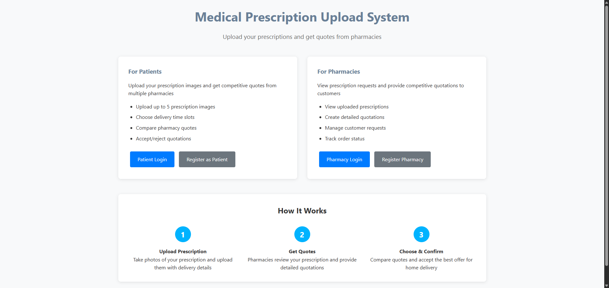

# Prescription Management System


## 🏥 Project Overview

This system allows patients to upload their medical prescriptions and receive competitive quotations from registered pharmacies. It streamlines the prescription fulfillment process by enabling digital prescription submission, automated quotation generation, and email notifications.

## ✨ Key Features

### For Patients (Users)

- **User Registration & Authentication**
  - Secure registration with personal details (Name, Email, Address, Contact, DOB)
  - Login/logout functionality
- **Prescription Upload**

  - Upload up to 5 prescription images per request
  - Add notes and special instructions
  - Specify delivery address and preferred time slots (2-hour windows)
  - Track prescription status (Pending, Quoted, Accepted, Rejected)

- **Quotation Management**
  - View detailed quotations from pharmacies
  - Compare drug prices, quantities, and total amounts
  - Accept or reject quotations
  - Receive email notifications for new quotations

### For Pharmacies

- **Pharmacy Registration & Authentication**
  - Register as a pharmacy user with business details
  - Secure login system
- **Prescription Processing**
  - View all pending prescriptions with uploaded images
  - Access patient delivery preferences and notes
- **Quotation System**

  - Create detailed quotations with individual drug items
  - Specify drug names, quantities, unit prices, and totals
  - Send quotations directly to patients
  - Track quotation status and patient responses

- **Order Management**
  - Monitor accepted quotations
  - Receive notifications when patients accept/reject quotes

## 🛠️ Technology Stack

- **Backend**: PHP 8.2.12
- **Database**: MySQL (MariaDB 10.4.32)
- **Frontend**: HTML5, CSS3, JavaScript
- **Server**: Apache (XAMPP)
- **Email**: PHP mail functionality
- **File Upload**: PHP file handling for prescription images

## 📋 System Requirements

- **XAMPP** (Apache + MySQL + PHP) or similar local server
- **PHP 8.0+**
- **MySQL 5.7+** or MariaDB 10.4+
- **Web Browser** (Chrome, Firefox, Safari, Edge)
- **Minimum 2GB RAM** for smooth operation

## 🚀 Installation & Setup

### 1. Prerequisites

- Download and install [XAMPP](https://www.apachefriends.org/download.html)
- Ensure Apache and MySQL services are running

### 2. Project Setup

```bash
# Clone or download the project
git clone https://github.com/ashiknizamdeen/ThreadForce.git

# Move to XAMPP htdocs directory
# Windows: C:\xampp\htdocs\
# Mac: /Applications/XAMPP/htdocs/
# Linux: /opt/lampp/htdocs/
```

### 3. Database Configuration

#### Create Database

1. Open phpMyAdmin at `http://localhost/phpmyadmin`
2. Create a new database as you prefer into 'database.sample.php'
3. Create database with same name in phpmyadmin

#### Configure Database Connection

1. Copy `database.sample.php` to `database.php`
2. Update your database credentials:

```php
<?php
$servername = "localhost";
$username = "root";           // Your MySQL username
$password = "";               // Your MySQL password (usually empty for XAMPP)
$dbname = "pres_system";      // Database name
```

### 4. Directory Setup

Create the following directories with write permissions:

```
uploads/
├── prescriptions/
```

### 5. Access the Application

- Open your browser and navigate to: `http://localhost/your-project-folder-name`
- Register as a new user or pharmacy
- Start using the system!

## 📊 Database Schema

The system uses five main tables:

### Users Table

- Stores both patient and pharmacy user information
- User types: 'user' (patient) or 'pharmacy'
- Includes authentication and contact details

### Prescriptions Table

- Stores prescription requests from patients
- Links to user accounts
- Tracks delivery preferences and status

### Prescription Images Table

- Stores file paths for uploaded prescription images
- Links to prescription records
- Supports multiple images per prescription

### Quotations Table

- Stores pharmacy quotations for prescriptions
- Tracks quotation status and amounts
- Links prescriptions to pharmacies

### Quotation Items Table

- Detailed breakdown of drugs in quotations
- Individual drug pricing and quantities
- Calculates line totals

## 🔧 Configuration Options

### File Upload Settings

- Maximum 5 images per prescription
- Supported formats: JPG, PNG, GIF
- Maximum file size: 5MB per image
- Files stored in `uploads/prescriptions/` directory

### Email Notifications

- Automatic email alerts for new quotations sent as a log file
- Acceptance/rejection notifications
- Configure SMTP settings in email configuration files

## 📱 User Guide

### For Patients

1. **Registration**: Create account with personal details
2. **Login**: Access your dashboard
3. **Upload Prescription**:
   - Select up to 5 prescription images
   - Add notes and delivery details
   - Submit for pharmacy review
4. **Review Quotations**: Check received quotes
5. **Accept/Reject**: Choose your preferred quotation

### For Pharmacies

1. **Registration**: Register as pharmacy user
2. **Login**: Access pharmacy dashboard
3. **View Prescriptions**: Browse pending prescriptions
4. **Create Quotations**:
   - Add individual drugs with quantities and prices
   - Calculate totals automatically
   - Send to patients
5. **Monitor Orders**: Track accepted quotations

## 🔒 Security Features

- **Password Hashing**: All passwords encrypted using PHP's `password_hash()`
- **SQL Injection Prevention**: Prepared statements with PDO
- **File Upload Validation**: Restricted file types and sizes
- **Session Management**: Secure user sessions
- **Input Sanitization**: All user inputs validated and sanitized

## 📁 Project Structure

```
PRESCRIPTION_SYSTEM/
├── admin/
│   ├── create_quotation.php
│   ├── dashboard.php
│   ├── view_prescriptions.php
│   └── ...
├── config/
│   ├── database.php
│   └── database.sample.php
├── css/
│   └── style.css
├── includes/
│   ├── footer.php
│   ├── functions.php
│   └── header.php
├── js/
│   └── scripts.js
├── pharmacy/
│   ├── dashboard.php
│   ├── email_log.txt
│   ├── login.php
│   └── view_prescription.php
├── uploads/
│   └── prescriptions/
├── user/
│   ├── dashboard.php
│   ├── login.php
│   └── logout.php
├── vendor/
├── database_structure.sql
├── index.php
└── README.md
```

## 🤝 Contributing

1. Fork the repository
2. Create a feature branch (`git checkout -b feature/AmazingFeature`)
3. Commit your changes (`git commit -m 'Add some AmazingFeature'`)
4. Push to the branch (`git push origin feature/AmazingFeature`)
5. Open a Pull Request

---

**Note**: This system is designed for educational purposes and should be thoroughly tested and secured before any production use in a real healthcare environment.

**Made with ❤️ by Ashik**
